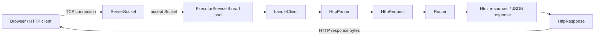

# Simple HTTP Server in Java

A minimal HTTP/1.1 server built from scratch with Java `ServerSocket`.

This project was created to understand what happens between a browser entering a URL and receiving a web page: TCP connections, sockets, HTTP request parsing, response construction, routing, concurrency, and error handling.

## Features

- Listens for TCP connections with `ServerSocket`
- Parses HTTP request line and headers
- Supports `GET` requests
- Routes requests to HTML and JSON responses
- Serves static HTML pages from Maven resources
- Handles multiple clients through a fixed thread pool
- Returns HTTP responses with:
  - `Content-Type`
  - `Content-Length`
  - `Connection: close`
- Supports status codes:
  - `200 OK`
  - `400 Bad Request`
  - `404 Not Found`
  - `405 Method Not Allowed`
  - `500 Internal Server Error`
- Includes unit and integration tests with JUnit and Maven
- Supports controlled server shutdown through `close()`

## Architecture



## Request Flow

```text
Browser sends HTTP request
        ↓
ServerSocket accepts a TCP connection
        ↓
A worker thread handles the client Socket
        ↓
HttpParser creates an HttpRequest
        ↓
Router selects an HttpResponse
        ↓
The server sends HTTP response bytes to the client
```

## Routes

| Method | Path | Response |
|---|---|---|
| `GET` | `/` | Home page (`index.html`) |
| `GET` | `/hello` | HTML greeting |
| `GET` | `/about` | About page (`about.html`) |
| `GET` | `/api/status` | JSON status response |
| `GET` | unknown path | `404 Not Found` |
| non-`GET` | any path | `405 Method Not Allowed` |

## Project Structure

```text
src/
├─ main/
│  ├─ java/dev/dasha/httpserver/
│  │  ├─ SimpleHttpServer.java
│  │  ├─ HttpParser.java
│  │  ├─ HttpRequest.java
│  │  ├─ HttpResponse.java
│  │  └─ Router.java
│  └─ resources/public/
│     ├─ index.html
│     └─ about.html
└─ test/java/dev/dasha/httpserver/
   ├─ HttpParserTest.java
   ├─ RouterTest.java
   └─ SimpleHttpServerIntegrationTest.java
```

## Concurrency Model

The main server thread accepts incoming TCP connections and submits each client socket to an `ExecutorService` with four worker threads.

```text
ServerSocket
    ↓
accept()
    ↓
ExecutorService
  ↙   ↓   ↓   ↘
worker 1  worker 2  worker 3  worker 4
```

This avoids blocking the main thread while one client is being processed. If all workers are busy, new tasks wait until a worker becomes available.

## How to Run

### Prerequisites

- JDK 21
- Maven 3.9+

### Compile

```powershell
mvn compile
```

### Start the Server

```powershell
java -cp target/classes dev.dasha.httpserver.SimpleHttpServer
```

Open:

```text
http://localhost:8080/
```

Stop the server with `Ctrl + C`.

## How to Test

```powershell
mvn test
```

The test suite includes:

- Unit tests for `HttpParser`
- Unit tests for `Router`
- An integration test that starts the real server on a temporary free port, makes an HTTP request, verifies the response, and stops the server

## HTTP Error Handling

| Situation | Status |
|---|---|
| Valid supported request | `200 OK` |
| Invalid request line or header | `400 Bad Request` |
| Unknown route | `404 Not Found` |
| Unsupported HTTP method | `405 Method Not Allowed` |
| Internal file or processing error | `500 Internal Server Error` |

## Limitations

This is an educational server and is not intended for production use.

- Only `GET` is supported
- Request bodies and `POST` are not implemented
- Query parameters are not parsed
- HTTP keep-alive is not supported
- HTTPS/TLS is not supported
- Chunked transfer encoding is not supported
- Header names are currently case-sensitive
- The static file server supports only explicitly mapped pages
- The shutdown process does not wait for every active worker task to finish

## Future Improvements

- Add `POST` support and request bodies
- Parse query parameters
- Make header lookup case-insensitive
- Add `Allow: GET` to `405 Method Not Allowed` responses
- Support more static file types such as CSS and JavaScript
- Add configurable server port and worker count
- Improve graceful shutdown by waiting for active requests
- Add logging with timestamps and log levels
- Add HTTPS support
